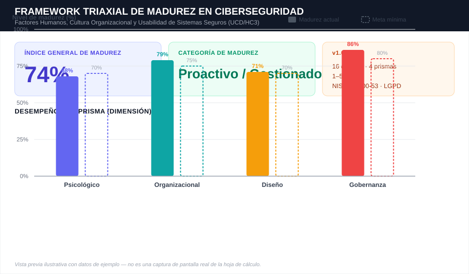

# 🛡️ Triaxial Cybersecurity Maturity Framework

  
  
  
  

  
  
  
  

**🌐 Leer en otro idioma:** [English](README.md) · [Português (BR)](README.pt-BR.md) · **Español**

> **Instrumento auditable y cuantitativo** para medir la madurez de ciberseguridad desde la perspectiva del factor humano, derivado del artículo *"Human Factors in Cybersecurity: A Triaxial Analysis from the Psychological, Organizational, and Design Perspectives, with an Extended Governance-Oriented Maturity Assessment Instrument"* (Santos, Silva & Florindo, PPEE/UnB).

---

## 📖 Sobre el Framework

Diversos estudios indican que **más del 95%** de los incidentes cibernéticos involucran, en algún nivel, error o manipulación humana. A pesar de ello, la mayoría de las organizaciones mide su postura de seguridad de forma puramente técnica o mediante *reach metrics* (cuántas personas "vieron la capacitación"), sin ninguna métrica objetiva de efectividad.

Este repositorio pone a disposición la hoja de cálculo **[`framework-triaxial-madurez-ciberseguridad.xlsx`](framework-triaxial-madurez-ciberseguridad.xlsx)** — la versión completamente en español de la hoja de cálculo original `cybersecurity-maturity-framework.xlsx` (hojas, encabezados, criterios y mensajes de validación traducidos) — que operacionaliza el **Modelo Triaxial** (Psicológico, Organizacional y de Diseño) descrito en el artículo, extendido con un **cuarto prisma de Gobernanza y Cumplimiento** (NIST SP 800-53 y LGPD), dando como resultado un instrumento de **16 criterios de evaluación, agrupados en 4 dimensiones**, con pesos y fórmulas ponderadas que generan un **Índice General de Madurez (Imat)** y una clasificación organizacional automática.

| Prisma | Enfoque | Referencia clave |
|---|---|---|
| 🧠 **Psicológico** | Amygdala hijacking, sesgo de automatización, alfabetización digital, phishing | Hadlington (2017); Hagen et al. (2025); Anwar et al. (2017) |
| 🏢 **Organizacional** | Paradoja conocimiento‑comportamiento, efectividad de CSA vía CTI, inteligencia integrada, notificación de incidentes | Georgiadou et al. (2022); Silva et al. (2025) |
| 🎨 **Diseño** | Framework HC3, carga cognitiva, *security by design*, gobernanza de BYOD/Shadow IT | Cristiano & Spadafora (2024); Gutzwiller & Van Bruggen (2021) |
| ⚖️ **Gobernanza y Cumplimiento** | Controles NIST SP 800‑53, principios de la LGPD, notificación al CTIR Gov, OSINT antifraude | NIST SP 800‑53 Rev. 5; LGPD (Ley n.º 13.709/2018) |

---

## 🖼️ Vista Previa del Panel de Control

  

Maqueta ilustrativa con datos de ejemplo que reproduce el diseño real de la hoja <code>Panel de Control</code> — Índice General de Madurez, Categoría de Madurez y el gráfico de desempeño por prisma. No es una captura de pantalla literal de la hoja de cálculo.

---

## 🗂️ Estructura de la Hoja de Cálculo

> Las tablas siguientes usan los nombres técnicos originales de las hojas/columnas (`Dashboard`, `Assessment`) para facilitar la referencia cruzada con las fórmulas y la versión en inglés. En la hoja de cálculo traducida `framework-triaxial-madurez-ciberseguridad.xlsx`, esas hojas se llaman **`Panel de Control`** y **`Evaluación`**, con todos los encabezados, criterios y mensajes de validación en español.

El libro tiene **2 hojas**:

### 1. `Dashboard` (**"Panel de Control"** en la versión ES) — Panel Ejecutivo

| Celda | Contenido | Fórmula |
|---|---|---|
| `A5:B6` | **Índice General de Madurez** | `=Assessment!H21/Assessment!I21` |
| `C5:D6` | **Categoría de Madurez** (veredicto dinámico) | `=IF(A5<0.4,"Vulnerable/Critical", IF(A5<0.6,"Reactive/Basic", IF(A5<0.8,"Proactive/Managed","Resilient/Optimized")))` |
| `F4:I8` | Tabla de referencia con la descripción de cada franja de madurez | estático |
| `A9:C13` | **Desempeño por Prisma**, calculado mediante `SUMIF` sobre la hoja `Assessment`, comparado con la meta mínima recomendada por dimensión | `=SUMIF(Assessment!$B$5:$B$20, "<Prisma>", Assessment!$H$5:$H$20) / SUMIF(...!$I$5:$I$20)` |
| — | Gráfico de columnas nativo que compara la **madurez actual vs. meta mínima** por prisma | Excel Chart |

### 2. `Assessment` (**"Evaluación"** en la versión ES) — Entrada de Datos (16 criterios)

| Columna | Nombre | Descripción |
|---|---|---|
| A | ID | Identificador del criterio (`PS-01`…`GO-04`) |
| B | Analysis Prism | Dimensión a la que pertenece el criterio |
| C | Metric / Requirement | Qué se está evaluando |
| D | Scientific Reference | Autor/año que fundamenta el criterio |
| E | Evidence & Evaluation Criteria | Descripción operativa de qué observar/auditar |
| **F** | **Score (1–5)** | 🔵 **Única columna editable** — puntuación asignada por el evaluador |
| G | Weight (1–3) | Peso del criterio dentro de la dimensión |
| H | Weighted Score | `=F*G` |
| I | Max Score | `=G*5` |
| J | Progress | `=H/I` (% de madurez del criterio) |
| 21 | **TOTALS & AVERAGES** | `F21=AVERAGE(F5:F20)` · `G21=SUM(G5:G20)` · `H21=SUM(H5:H20)` · `I21=SUM(I5:I20)` · `J21=H21/I21` |

> 🔒 **Validación de datos:** el rango `F5:F20` acepta **únicamente números enteros del 1 al 5**. Cualquier otro valor es rechazado por la regla `dataValidation` incorporada en la hoja, con el mensaje *"La puntuación introducida debe ser un número entero del 1 al 5."*

---

## 📐 Fórmula del Índice General de Madurez

$$
I_{mat} = \frac{\sum_{i=1}^{16} s_i \cdot w_i}{\sum_{i=1}^{16} 5 \cdot w_i} \times 100\%
$$

donde `sᵢ ∈ {1,...,5}` es la puntuación asignada al criterio *i* y `wᵢ` es el peso del criterio, según la tabla de criterios a continuación.

### 🚦 Clasificación de Madurez

| Franja | Categoría | Significado |
|---|---|---|
| 🔴 `< 40%` | **Vulnerable / Crítico** | Alta exposición a la manipulación y fallos graves de proceso/diseño |
| 🟠 `41% – 60%` | **Reactivo / Básico** | Cumplimiento burocrático de política formal de TI, bajo compromiso real |
| 🟡 `61% – 80%` | **Proactivo / Gestionado** | Monitoreo activo mediante inteligencia e interfaces centradas en el usuario |
| 🟢 `81% – 100%` | **Resiliente / Optimizado** | Cultura de resiliencia integrada, cumplimiento nativo, seguridad *by design* |

---

## 📋 Los 16 Criterios de Evaluación

<b>🧠 Prisma Psicológico</b> (clic para expandir)

| ID | Criterio | Peso |
|---|---|:---:|
| `PS-01` | Control de Amygdala Hijacking | 3 |
| `PS-02` | Atenuación del sesgo de automatización/confirmación | 2 |
| `PS-03` | Autoeficacia y alfabetización digital | 2 |
| `PS-04` | Susceptibilidad al phishing | 3 |

<b>🏢 Prisma Organizacional</b>

| ID | Criterio | Peso |
|---|---|:---:|
| `OR-01` | Paradoja conocimiento–comportamiento | 2 |
| `OR-02` | Efectividad/resiliencia de CSA vía CTI | 3 |
| `OR-03` | Proceso de inteligencia integrada | 2 |
| `OR-04` | Notificación ágil de incidentes | 2 |

<b>🎨 Prisma de Diseño</b>

| ID | Criterio | Peso |
|---|---|:---:|
| `DS-01` | Uso del framework HC3 | 3 |
| `DS-02` | Carga cognitiva y fricción de autenticación | 2 |
| `DS-03` | *Security by Design* y control humano | 2 |
| `DS-04` | Gobernanza de BYOD y Shadow IT | 1 |

<b>⚖️ Prisma de Gobernanza y Cumplimiento</b>

| ID | Criterio | Peso |
|---|---|:---:|
| `GO-01` | Controles de gobernanza NIST SP 800-53 (PM/AC/CA) | 3 |
| `GO-02` | Controles de detección/respuesta NIST SP 800-53 (AU/PT/IR/CP) | 3 |
| `GO-03` | Principios de privacidad de la LGPD | 2 |
| `GO-04` | Blindaje OSINT y mitigación de fraude | 1 |

---

## 🚀 Cómo Usar

1. **Abra** el archivo `framework-triaxial-madurez-ciberseguridad.xlsx` en Excel, LibreOffice Calc o Google Sheets.
2. Vaya a la hoja **`Evaluación`**.
3. Para cada uno de los 16 criterios (filas 5 a 20), complete la columna **`F` (Score)** con una puntuación de **1 a 5**, con base en la evidencia descrita en la columna `E`:

   | Puntuación | Significado |
   |:---:|---|
   | 1 | Muy débil / crítico — inexistente |
   | 2 | Débil — ad hoc, no documentado |
   | 3 | Intermedio — parcialmente implementado |
   | 4 | Bueno — implementado y monitoreado |
   | 5 | Líder / resiliente — optimizado y auditado |

4. Vuelva a la hoja **`Panel de Control`** — el **Índice General de Madurez**, la **categoría** y el **gráfico por prisma** se recalculan automáticamente.
5. Use la tabla **"Performance by Prism"** para identificar los **cuellos de botella** (el prisma con la mayor brecha entre la madurez actual y la meta mínima recomendada).
6. Reaplique la evaluación periódicamente (p. ej., semestralmente) para dar seguimiento a la evolución del índice en el tiempo.

> ⚠️ No edite las columnas `H`, `I` ni `J` — contienen fórmulas calculadas automáticamente a partir de la puntuación (`F`) y el peso (`G`).

---

## 🔬 Fundamentación Científica

El framework operacionaliza, entre otros, los siguientes modelos citados en el artículo original:

- **Modelo de efectividad de CSA vía CTI** (Silva et al., 2025) — base del criterio `OR-02`, cruzando la participación en capacitaciones con datos reales de exposición de credenciales.
- **Framework HC3** (Cristiano & Spadafora, 2024) — base del criterio `DS-01`, con las 8 etapas de diseño centrado en el usuario para sistemas criptográficos.
- **17 factores humanos en ciberseguridad** (Rohan et al., 2021) — fundamentan los criterios del prisma Psicológico.
- **NIST SP 800-53 Rev. 5** y **LGPD (Ley n.º 13.709/2018)** — fundamentan el cuarto prisma de Gobernanza.

## 🔬 Rigor Científico, Alcance y Trabajo Futuro (v1.0)

Este framework fue diseñado siguiendo un proceso metodológico riguroso de síntesis de la literatura sobre factores humanos en ciberseguridad. Como un proyecto científico de código abierto (Open Science) en su versión inicial (v1.0), su alcance de aplicación está delimitado por los siguientes parámetros académicos, los cuales ya están siendo abordados en nuestra hoja de ruta de investigación:

1. **Validación y Calibración de Pesos**: La asignación actual de pesos ($w_i$) refleja la síntesis cualitativa y teórica de los autores basada en la literatura revisada. Se planean pruebas empíricas a gran escala y paneles de expertos (Método Delphi) para refinar y calibrar estadísticamente estos coeficientes.
2. **Representatividad de la Literatura**: La base conceptual del framework priorizó revistas y conferencias internacionales indexadas de alta relevancia (predominantemente de alcance occidental). Futuras expansiones mapearán matices culturales y de comportamiento específicos de infraestructuras críticas del Sur Global.
3. **Análisis de Causalidad**: El instrumento actual proporciona un diagnóstico fotográfico (punto en el tiempo) de la madurez. Se requieren estudios longitudinales futuros para establecer correlaciones causales de largo plazo entre la evolución del Índice General de Madurez ($I_{mat}$) y la reducción de incidentes reales.

## 📌 Cita y Preservación a Largo Plazo

Este repositorio es un enlace mutable de GitHub; para citarlo en la sección de metodología de un artículo, archive una instantánea versionada en **[Zenodo](https://zenodo.org)** (gratuito, respaldado por el CERN) para obtener un **DOI** permanente. En resumen: inicie sesión en Zenodo con su cuenta de GitHub, habilite este repositorio en la integración de Zenodo con GitHub y cree un Release en GitHub — Zenodo archivará automáticamente ese release y generará un DOI que podrá citar directamente en el artículo.

---

  Basado en Santos, K. J. O.; Silva, D. A.; Florindo, L. G. M. — Programa de Posgrado Profesional en Ingeniería Eléctrica (PPEE), Universidad de Brasilia (UnB).

