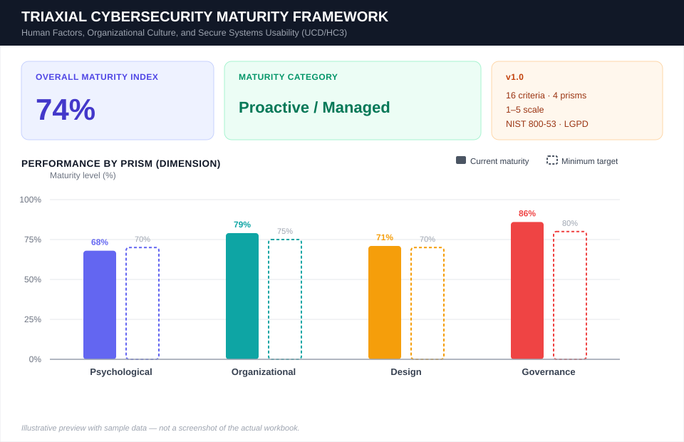

# 🛡️ Triaxial Cybersecurity Maturity Framework

  
  
  
  

  
  
  
  

**🌐 Read this in another language:** **English** · [Português (BR)](README.pt-BR.md) · [Español](README.es.md)

> **An auditable, quantitative instrument** for measuring cybersecurity maturity through the lens of the human factor, derived from the paper *"Human Factors in Cybersecurity: A Triaxial Analysis from the Psychological, Organizational, and Design Perspectives, with an Extended Governance-Oriented Maturity Assessment Instrument"* (Santos, Silva & Florindo, PPEE/UnB).

---

## 📖 About the Framework

Studies indicate that **more than 95%** of cyber incidents involve, at some level, human error or manipulation. Despite this, most organizations still measure their security posture in purely technical terms or through *reach metrics* (how many people "watched the training"), without any objective effectiveness metric.

This repository provides the spreadsheet **`cybersecurity-maturity-framework.xlsx`**, which operationalizes the **Triaxial Model** (Psychological, Organizational, and Design) described in the paper, extended with a **fourth prism — Governance and Compliance** (NIST SP 800-53 and LGPD), resulting in an instrument with **16 evaluation criteria, grouped into 4 dimensions**, with weights and weighted formulas that generate an **Overall Maturity Index (Imat)** and an automatic organizational classification.

| Prism | Focus | Key Reference |
|---|---|---|
| 🧠 **Psychological** | Amygdala hijacking, automation bias, digital literacy, phishing | Hadlington (2017); Hagen et al. (2025); Anwar et al. (2017) |
| 🏢 **Organizational** | Knowledge–behavior paradox, CTI-based CSA effectiveness, integrated intelligence, incident notification | Georgiadou et al. (2022); Silva et al. (2025) |
| 🎨 **Design** | HC3 framework, cognitive load, security by design, BYOD/Shadow IT governance | Cristiano & Spadafora (2024); Gutzwiller & Van Bruggen (2021) |
| ⚖️ **Governance and Compliance** | NIST SP 800-53 controls, LGPD principles, CTIR Gov notification, OSINT anti-fraud | NIST SP 800-53 Rev. 5; LGPD (Law No. 13.709/2018) |

---

## 🖼️ Dashboard Preview

  

Illustrative mockup with sample data reproducing the actual layout of the <code>Dashboard</code> sheet — Overall Maturity Index, Maturity Category, and the per-prism performance chart. Not a literal screenshot of the workbook.

---

## 🗂️ Spreadsheet Structure

The workbook has **2 sheets**:

### 1. `Dashboard` — Executive Panel

| Cell | Content | Formula |
|---|---|---|
| `A5:B6` | **Overall Maturity Index** | `=Assessment!H21/Assessment!I21` |
| `C5:D6` | **Maturity Category** (dynamic verdict) | `=IF(A5<0.4,"Vulnerable/Critical", IF(A5<0.6,"Reactive/Basic", IF(A5<0.8,"Proactive/Managed","Resilient/Optimized")))` |
| `F4:I8` | Reference table describing each maturity band | static |
| `A9:C13` | **Performance by Prism**, computed via `SUMIF` over the `Assessment` sheet, compared against the recommended minimum target per dimension | `=SUMIF(Assessment!$B$5:$B$20, "<Prism>", Assessment!$H$5:$H$20) / SUMIF(...!$I$5:$I$20)` |
| — | Native column chart comparing **current maturity vs. minimum target** per prism | Excel Chart |

### 2. `Assessment` — Data Entry (16 criteria)

| Column | Name | Description |
|---|---|---|
| A | ID | Criterion identifier (`PS-01`…`GO-04`) |
| B | Analysis Prism | Dimension the criterion belongs to |
| C | Metric / Requirement | What is being evaluated |
| D | Scientific Reference | Author/year underpinning the criterion |
| E | Evidence & Evaluation Criteria | Operational description of what to observe/audit |
| **F** | **Score (1–5)** | 🔵 **Only editable column** — score assigned by the assessor |
| G | Weight (1–3) | Weight of the criterion within its dimension |
| H | Weighted Score | `=F*G` |
| I | Max Score | `=G*5` |
| J | Progress | `=H/I` (% maturity of the criterion) |
| 21 | **TOTALS & AVERAGES** | `F21=AVERAGE(F5:F20)` · `G21=SUM(G5:G20)` · `H21=SUM(H5:H20)` · `I21=SUM(I5:I20)` · `J21=H21/I21` |

> 🔒 **Data validation:** the range `F5:F20` accepts **only whole numbers from 1 to 5**. Any other value is rejected by the built-in `dataValidation` rule, with the message *"The entered score must be a whole number from 1 to 5."*

---

## 📐 Overall Maturity Index Formula

$$
I_{mat} = \frac{\sum_{i=1}^{16} s_i \cdot w_i}{\sum_{i=1}^{16} 5 \cdot w_i} \times 100\%
$$

where `sᵢ ∈ {1,...,5}` is the score assigned to criterion *i* and `wᵢ` is the criterion's weight, per the criteria table below.

### 🚦 Maturity Classification

| Band | Category | Meaning |
|---|---|---|
| 🔴 `< 40%` | **Vulnerable / Critical** | High exposure to manipulation and severe process/design failures |
| 🟠 `41% – 60%` | **Reactive / Basic** | Bureaucratic compliance with formal IT policy, low real engagement |
| 🟡 `61% – 80%` | **Proactive / Managed** | Active monitoring via intelligence and user-centered interfaces |
| 🟢 `81% – 100%` | **Resilient / Optimized** | Integrated resilience culture, native compliance, security by design |

---

## 📋 The 16 Evaluation Criteria

<b>🧠 Psychological Prism</b> (click to expand)

| ID | Criterion | Weight |
|---|---|:---:|
| `PS-01` | Control of amygdala hijacking | 3 |
| `PS-02` | Attenuation of automation/confirmation bias | 2 |
| `PS-03` | Self-efficacy & digital literacy | 2 |
| `PS-04` | Phishing susceptibility | 3 |

<b>🏢 Organizational Prism</b>

| ID | Criterion | Weight |
|---|---|:---:|
| `OR-01` | Knowledge–behavior paradox | 2 |
| `OR-02` | CSA effectiveness/resilience via CTI | 3 |
| `OR-03` | Integrated intelligence process | 2 |
| `OR-04` | Agile incident notification | 2 |

<b>🎨 Design Prism</b>

| ID | Criterion | Weight |
|---|---|:---:|
| `DS-01` | Use of the HC3 framework | 3 |
| `DS-02` | Cognitive load & authentication friction | 2 |
| `DS-03` | Security by Design & human control | 2 |
| `DS-04` | BYOD & Shadow IT governance | 1 |

<b>⚖️ Governance and Compliance Prism</b>

| ID | Criterion | Weight |
|---|---|:---:|
| `GO-01` | NIST SP 800-53 governance controls (PM/AC/CA) | 3 |
| `GO-02` | NIST SP 800-53 detect/respond controls (AU/PT/IR/CP) | 3 |
| `GO-03` | LGPD privacy principles | 2 |
| `GO-04` | OSINT shielding & fraud mitigation | 1 |

---

## 🚀 How to Use

1. **Open** `cybersecurity-maturity-framework.xlsx` in Excel, LibreOffice Calc, or Google Sheets.
2. Go to the **`Assessment`** sheet.
3. For each of the 16 criteria (rows 5 to 20), fill in column **`F` (Score)** with a rating from **1 to 5**, based on the evidence described in column `E`:

   | Score | Meaning |
   |:---:|---|
   | 1 | Very weak / critical — non-existent |
   | 2 | Weak — ad hoc, undocumented |
   | 3 | Intermediate — partially implemented |
   | 4 | Good — implemented and monitored |
   | 5 | Leader / resilient — optimized and audited |

4. Go back to the **`Dashboard`** sheet — the **Overall Maturity Index**, the **category**, and the **per-prism chart** are recalculated automatically.
5. Use the **"Performance by Prism"** table to identify **bottlenecks** (the prism with the largest gap between current maturity and the recommended minimum target).
6. Reapply the assessment periodically (e.g., semi-annually) to track the index's evolution over time.

> ⚠️ Do not edit columns `H`, `I`, and `J` — they contain formulas calculated automatically from the score (`F`) and the weight (`G`).

---

## 🔬 Scientific Foundation

The framework operationalizes, among others, the following models cited in the original paper:

- **CTI-based CSA effectiveness model** (Silva et al., 2025) — underpins criterion `OR-02`, cross-referencing training participation with real credential-exposure data.
- **HC3 framework** (Cristiano & Spadafora, 2024) — underpins criterion `DS-01`, with the 8 user-centered design stages for cryptographic systems.
- **17 human factors in cybersecurity** (Rohan et al., 2021) — underpin the criteria of the Psychological prism.
- **NIST SP 800-53 Rev. 5** and **LGPD (Law No. 13.709/2018)** — underpin the fourth, Governance prism.

## ⚠️ Limitations (v1.0)

- The instrument has **not yet undergone external validation**; its weights reflect the authors' synthesis and should be treated as a first approximation.
- Predominantly Western scope of the underlying literature.
- Absence of longitudinal causality studies.

## 📌 Citing This Work / Long-Term Archival

This repository is a mutable GitHub link; for citation in a paper's methodology section, archive a versioned snapshot on **[Zenodo](https://zenodo.org)** (free, CERN-backed) to obtain a permanent **DOI**. In short: sign in to Zenodo with your GitHub account, enable this repository under Zenodo's GitHub integration, then cut a GitHub Release — Zenodo automatically archives that release and mints a DOI you can cite directly in the paper.

---

  Based on Santos, K. J. O.; Silva, D. A.; Florindo, L. G. M. — Professional Graduate Program in Electrical Engineering (PPEE), University of Brasília (UnB).

