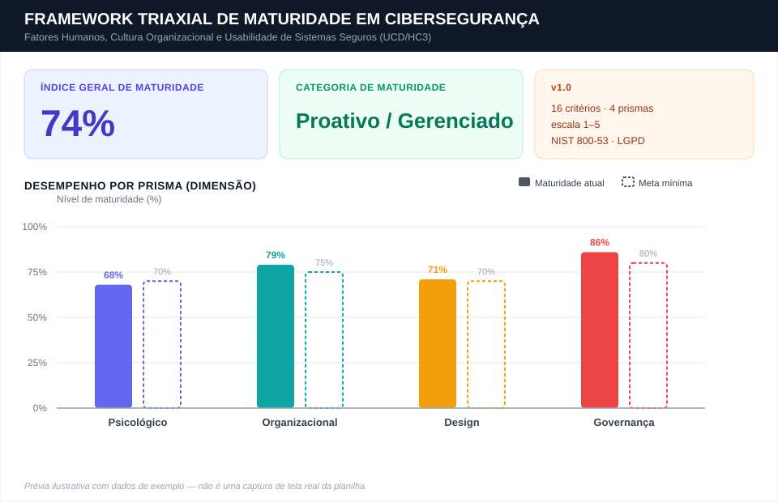

# 🛡️ Triaxial Cybersecurity Maturity Framework

  
  
  
  

  
  
  
  

**🌐 Leia em outro idioma:** [English](README.md) · **Português (BR)** · [Español](README.es.md)

> **Instrumento auditável e quantitativo** para medir a maturidade de cibersegurança sob a ótica do fator humano, derivado do artigo *"Human Factors in Cybersecurity: A Triaxial Analysis from the Psychological, Organizational, and Design Perspectives, with an Extended Governance-Oriented Maturity Assessment Instrument"* (Santos, Silva & Florindo, PPEE/UnB).

---

## 📖 Sobre o Framework

Estudos apontam que **mais de 95%** dos incidentes cibernéticos envolvem, em algum nível, erro ou manipulação humana. Apesar disso, a maioria das organizações mede sua postura de segurança de forma puramente técnica ou por *reach metrics* (quantas pessoas "assistiram ao treinamento"), sem nenhuma métrica objetiva de efetividade.

Este repositório disponibiliza a planilha **[`framework-triaxial-maturidade-ciberseguranca.xlsx`](framework-triaxial-maturidade-ciberseguranca.xlsx)** — a versão totalmente em português da planilha original `cybersecurity-maturity-framework.xlsx` (abas, cabeçalhos, critérios e mensagens de validação traduzidos) — que opera­cionaliza o **Modelo Triaxial** (Psicológico, Organizacional e Design) descrito no artigo, estendido com um **quarto prisma de Governança e Conformidade** (NIST SP 800-53 e LGPD), resultando em um instrumento de **16 critérios de avaliação, agrupados em 4 dimensões**, com pesos e fórmulas ponderadas que geram um **Índice Geral de Maturidade (Imat)** e uma classificação organizacional automática.

| Prisma | Foco | Referência-chave |
|---|---|---|
| 🧠 **Psicológico** | Amygdala hijacking, viés de automação, letramento digital, phishing | Hadlington (2017); Hagen et al. (2025); Anwar et al. (2017) |
| 🏢 **Organizacional** | Paradoxo conhecimento‑comportamento, efetividade de CSA via CTI, inteligência integrada, notificação de incidentes | Georgiadou et al. (2022); Silva et al. (2025) |
| 🎨 **Design** | Framework HC3, carga cognitiva, *security by design*, governança de BYOD/Shadow IT | Cristiano & Spadafora (2024); Gutzwiller & Van Bruggen (2021) |
| ⚖️ **Governança e Conformidade** | Controles NIST SP 800‑53, princípios da LGPD, notificação ao CTIR Gov, OSINT antifraude | NIST SP 800‑53 Rev. 5; LGPD (Lei nº 13.709/2018) |

---

## 🖼️ Prévia do Painel Executivo

  

Mockup ilustrativo com dados de exemplo, reproduzindo o layout real da aba <code>Painel de Controle</code> — Índice Geral de Maturidade, Categoria de Maturidade e o gráfico de desempenho por prisma. Não é uma captura de tela literal da planilha.

---

## 🗂️ Estrutura da Planilha

> As tabelas abaixo usam os nomes técnicos originais das abas/colunas (`Dashboard`, `Assessment`) para facilitar a referência cruzada com fórmulas e a versão em inglês. Na planilha traduzida `framework-triaxial-maturidade-ciberseguranca.xlsx`, essas abas se chamam **`Painel de Controle`** e **`Avaliação`**, com todos os cabeçalhos, critérios e mensagens de validação em português.

A planilha possui **2 abas**:

### 1. `Dashboard` (**"Painel de Controle"** na versão PT) — Painel Executivo

| Célula | Conteúdo | Fórmula |
|---|---|---|
| `A5:B6` | **Índice Geral de Maturidade** | `=Assessment!H21/Assessment!I21` |
| `C5:D6` | **Categoria de Maturidade** (veredito dinâmico) | `=IF(A5<0.4,"Vulnerable/Critical", IF(A5<0.6,"Reactive/Basic", IF(A5<0.8,"Proactive/Managed","Resilient/Optimized")))` |
| `F4:I8` | Tabela de referência com a descrição de cada faixa de maturidade | estático |
| `A9:C13` | **Desempenho por Prisma**, calculado via `SUMIF` sobre a aba `Assessment`, comparado à meta mínima recomendada por dimensão | `=SUMIF(Assessment!$B$5:$B$20, "<Prisma>", Assessment!$H$5:$H$20) / SUMIF(...!$I$5:$I$20)` |
| — | Gráfico de colunas nativo comparando **maturidade atual vs. meta mínima** por prisma | Excel Chart |

### 2. `Assessment` (**"Avaliação"** na versão PT) — Entrada de Dados (16 critérios)

| Coluna | Nome | Descrição |
|---|---|---|
| A | ID | Identificador do critério (`PS-01`…`GO-04`) |
| B | Analysis Prism | Dimensão à qual o critério pertence |
| C | Metric / Requirement | O que está sendo avaliado |
| D | Scientific Reference | Autor/ano que fundamenta o critério |
| E | Evidence & Evaluation Criteria | Descrição operacional do que observar/auditar |
| **F** | **Score (1–5)** | 🔵 **Única coluna editável** — nota atribuída pelo avaliador |
| G | Weight (1–3) | Peso do critério na dimensão |
| H | Weighted Score | `=F*G` |
| I | Max Score | `=G*5` |
| J | Progress | `=H/I` (% de maturidade do critério) |
| 21 | **TOTALS & AVERAGES** | `F21=AVERAGE(F5:F20)` · `G21=SUM(G5:G20)` · `H21=SUM(H5:H20)` · `I21=SUM(I5:I20)` · `J21=H21/I21` |

> 🔒 **Validação de dados:** o intervalo `F5:F20` aceita **somente números inteiros de 1 a 5**. Qualquer outro valor é rejeitado pela regra `dataValidation` embutida na planilha, com a mensagem *"A nota inserida deve ser um número inteiro de 1 a 5."*

---

## 📐 Fórmula do Índice Geral de Maturidade

$$
I_{mat} = \frac{\sum_{i=1}^{16} s_i \cdot w_i}{\sum_{i=1}^{16} 5 \cdot w_i} \times 100\%
$$

onde `sᵢ ∈ {1,...,5}` é a nota atribuída ao critério *i* e `wᵢ` é o peso do critério, conforme a tabela de critérios abaixo.

### 🚦 Classificação de Maturidade

| Faixa | Categoria | Significado |
|---|---|---|
| 🔴 `< 40%` | **Vulnerável / Crítico** | Alta exposição à manipulação e falhas graves de processo/design |
| 🟠 `41% – 60%` | **Reativo / Básico** | Cumprimento burocrático de política formal de TI, baixo engajamento real |
| 🟡 `61% – 80%` | **Proativo / Gerenciado** | Monitoramento ativo via inteligência e interfaces centradas no usuário |
| 🟢 `81% – 100%` | **Resiliente / Otimizado** | Cultura de resiliência integrada, conformidade nativa, segurança *by design* |

---

## 📋 Os 16 Critérios de Avaliação

<b>🧠 Prisma Psicológico</b> (clique para expandir)

| ID | Critério | Peso |
|---|---|:---:|
| `PS-01` | Controle de Amygdala Hijacking | 3 |
| `PS-02` | Atenuação de viés de automação/confirmação | 2 |
| `PS-03` | Autoeficácia e letramento digital | 2 |
| `PS-04` | Suscetibilidade a phishing | 3 |

<b>🏢 Prisma Organizacional</b>

| ID | Critério | Peso |
|---|---|:---:|
| `OR-01` | Paradoxo conhecimento–comportamento | 2 |
| `OR-02` | Efetividade/resiliência de CSA via CTI | 3 |
| `OR-03` | Processo de inteligência integrada | 2 |
| `OR-04` | Notificação ágil de incidentes | 2 |

<b>🎨 Prisma de Design</b>

| ID | Critério | Peso |
|---|---|:---:|
| `DS-01` | Uso do framework HC3 | 3 |
| `DS-02` | Carga cognitiva e fricção de autenticação | 2 |
| `DS-03` | *Security by Design* e controle humano | 2 |
| `DS-04` | Governança de BYOD e Shadow IT | 1 |

<b>⚖️ Prisma de Governança e Conformidade</b>

| ID | Critério | Peso |
|---|---|:---:|
| `GO-01` | Controles de governança NIST SP 800-53 (PM/AC/CA) | 3 |
| `GO-02` | Controles de detecção/resposta NIST SP 800-53 (AU/PT/IR/CP) | 3 |
| `GO-03` | Princípios de privacidade da LGPD | 2 |
| `GO-04` | Blindagem OSINT e mitigação de fraude | 1 |

---

## 🚀 Como Usar

1. **Abra** o arquivo `framework-triaxial-maturidade-ciberseguranca.xlsx` no Excel, LibreOffice Calc ou Google Sheets.
2. Vá até a aba **`Avaliação`**.
3. Para cada um dos 16 critérios (linhas 5 a 20), preencha a coluna **`F` (Score)** com uma nota de **1 a 5**, com base nas evidências descritas na coluna `E`:

   | Nota | Significado |
   |:---:|---|
   | 1 | Muito fraco / crítico — inexistente |
   | 2 | Fraco — ad hoc, não documentado |
   | 3 | Intermediário — parcialmente implementado |
   | 4 | Bom — implementado e monitorado |
   | 5 | Líder / resiliente — otimizado e auditado |

4. Volte para a aba **`Painel de Controle`** — o **Índice Geral de Maturidade**, a **categoria** e o **gráfico por prisma** são recalculados automaticamente.
5. Use a tabela **"Performance by Prism"** para identificar os **gargalos** (o prisma com maior distância entre maturidade atual e meta mínima recomendada).
6. Reaplique a avaliação periodicamente (ex.: semestral) para acompanhar a evolução do índice ao longo do tempo.

> ⚠️ Não edite as colunas `H`, `I` e `J` — elas contêm fórmulas calculadas automaticamente a partir da nota (`F`) e do peso (`G`).

---

## 🔬 Fundamentação Científica

O framework opera­cionaliza, entre outros, os seguintes modelos citados no artigo original:

- **Modelo de efetividade de CSA via CTI** (Silva et al., 2025) — base do critério `OR-02`, cruzando participação em treinamentos com dados reais de exposição de credenciais.
- **Framework HC3** (Cristiano & Spadafora, 2024) — base do critério `DS-01`, com as 8 etapas de design centrado no usuário para sistemas criptográficos.
- **17 fatores humanos em cibersegurança** (Rohan et al., 2021) — fundamentam os critérios do prisma Psicológico.
- **NIST SP 800-53 Rev. 5** e **LGPD (Lei nº 13.709/2018)** — fundamentam o quarto prisma de Governança.

## ⚠️ Limitações (v1.0)

- O instrumento ainda **não passou por validação externa**; os pesos refletem a síntese dos autores e devem ser tratados como uma primeira aproximação.
- Escopo de literatura predominantemente ocidental.
- Ausência de estudos longitudinais de causalidade.

## 📌 Citação e Preservação de Longo Prazo

Este repositório é um link mutável do GitHub; para citação na seção de metodologia de um artigo, arquive um snapshot versionado no **[Zenodo](https://zenodo.org)** (gratuito, mantido pelo CERN) para obter um **DOI** permanente. Em resumo: faça login no Zenodo com sua conta do GitHub, habilite este repositório na integração do Zenodo com o GitHub e crie uma Release no GitHub — o Zenodo arquiva automaticamente essa release e gera um DOI que pode ser citado diretamente no artigo.

---

  Baseado em Santos, K. J. O.; Silva, D. A.; Florindo, L. G. M. — Programa de Pós-Graduação Profissional em Engenharia Elétrica (PPEE), Universidade de Brasília (UnB).

